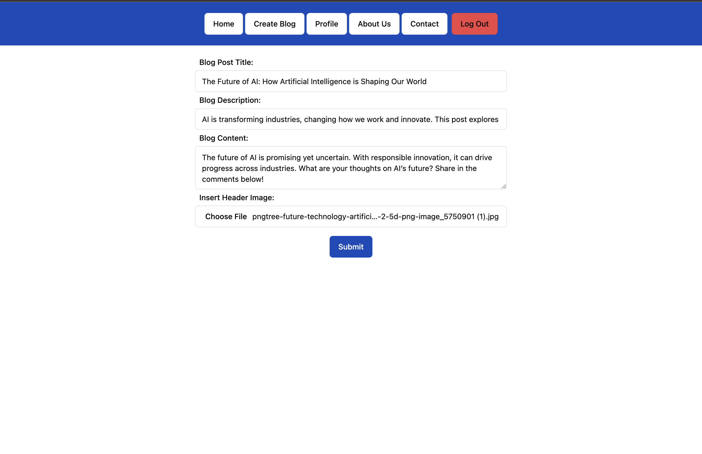
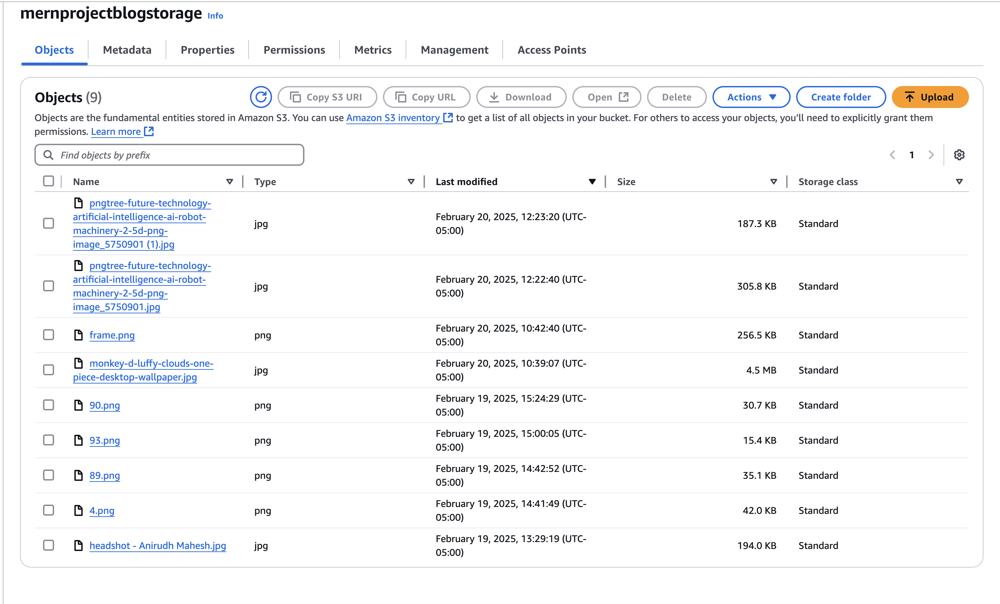
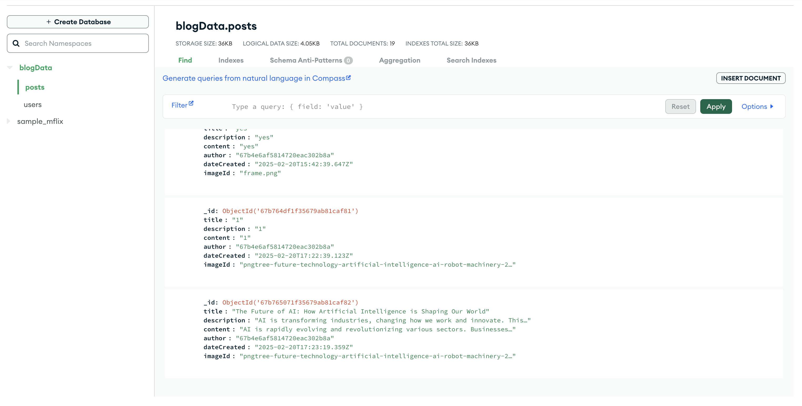

Blog Posting Website

This is a full-stack MERN (MongoDB, Express.js, React, Node.js) blog posting website that allows users to create, edit, and manage blog posts. The project showcases a dynamic frontend with React and a powerful backend with Node.js and Express, connected to MongoDB for data storage.

🚀 Technologies Used

Frontend: React.js, React Router, Tailwind CSS, ShadCN

Backend: Node.js, Express.js, MongoDB

Authentication: JSON Web Tokens (JWT)

File Uploads: Multer, AWS S3

State Management: React Hooks & Context API

API Calls: Axios

Version Control: Git & GitHub

📌 Features

User authentication (Login & Register)

Create, read, update, and delete (CRUD) blog posts

Image upload functionality using AWS S3

Responsive UI with Tailwind CSS and ShadCN components

Protected routes with JWT authentication

RESTful API design

## 🖼 Screenshots

### Blog Display

### Creating a Blog Post

### AWS S3 Integration for Image Storage

### MongoDB Database Setup

💡 What I Learned

Setting up a MERN stack project from scratch

Implementing user authentication with JWT

Managing REST API requests using Express and MongoDB

Handling file uploads using Multer and AWS S3

Learning AWS IAM Users, Permissions, and Policies for secure storage

Uploading and retrieving images from AWS S3

Creating a responsive and dynamic UI with React, Tailwind CSS, and ShadCN

Using ShadCN for modern UI components like buttons and modals

Using React Router for client-side navigation

Managing state efficiently with Context API

Debugging and troubleshooting CORS issues in a full-stack application

Uploading and managing MongoDB data effectively

📜 How to Run the Project

1️⃣ Clone the Repository

git clone https://github.com/AnirudhMahesh13/Blog-Posting-Website.git
cd Blog-Posting-Website

2️⃣ Install Dependencies

Backend:

cd backend
npm install

Frontend:

cd frontend
npm install

3️⃣ Run the Development Servers

Backend:

cd backend
npm start

Frontend:

cd frontend
npm start

The app should now be running the backend on http://localhost:3000/ and the frontend on http://localhost:5173/.

🔗 Contributing

Feel free to fork the repository, create a branch, and submit a pull request if you have any improvements or suggestions!

📧 Contact

For any questions or suggestions, feel free to reach out via GitHub.

⭐ If you like this project, consider giving it a star on GitHub!

